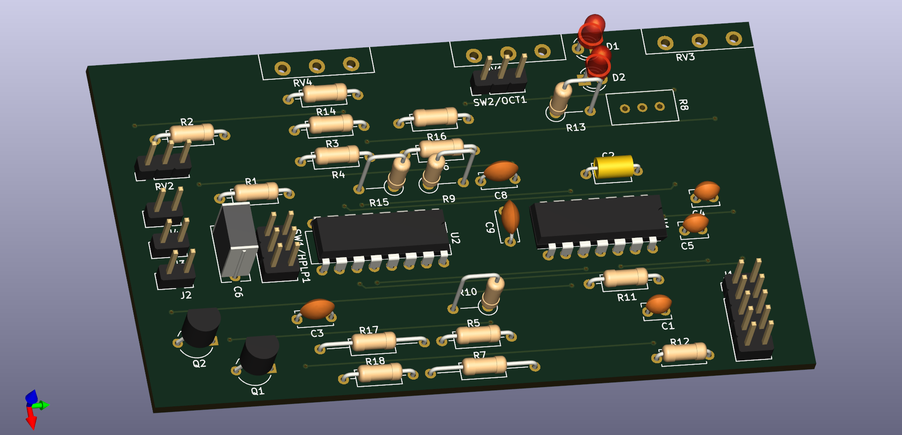

# diy-synth

Schematics and related files for DIY modular synthesizer components.

## MS-20 VCF

A voltage controller filter based on the "late" Korg MS-20 design. Original design schematics from [Rene Schmitz](https://www.schmitzbits.de/ms20.html) and [Eddy Bergman](https://www.eddybergman.com/2019/12/synthesizer-build-part-12-korg-ms20.html?m=1).

**Working Falstad circuit simulation (online):** [click here][1]

### Features

* Designed for Eurorack format with a 6 HP frontplate and standard +/- 12 V power supply.
* Frontplate potentiometers to control filter cutoff, resonance, input level, and cutoff CV amount.
* Input jacks for source audio signal and cutoff CV; output jack for filtered audio signal.
* Quad opamp (LM324N) and dual OTA (LM13700) in the main circuit.
* LEDs in the resonance feedback circuit indicate resonance "drive".

### Layout

* Circuit schematics: (VCF_MS-20_plan.pdf)[./schematics/VCF_MS-20_plan.pdf]
* Board layout: (VCF_MS-20_pcb.pdf)[./schematics/VCF_MS-20_pcb.pdf]
 * The board is a 21 x 36 hole (56 x 97 mm) perforated PCB that should fit in most Eurorack cases. The full depth is about 60 mm.
* Board layout with frontplate design: (VCF_MS-20_pcb_all.pdf)[./schematics/VCF_MS-20_pcb_all.pdf]
 * The frontplate is designed for Eurorack cases and has a size of 3 U x 6 HP (127 x 30.5 mm)

### Components (BOM)

|Item |Qty  |Reference(s)                  |Value          |Datasheet                                         |Note           |
|----:|----:|-----------------------------:|--------------:|--------------------------------------------------|---------------|
|    1|    1|                            C1|           4.7n|~                                                 |               |
|    2|    2|                        C2, C3|           1.0n|~                                                 |film cap.      |
|    3|    2|                        C4, C5|           100n|~                                                 |               |
|    4|    1|                            C6|           1.0u|~                                                 |               |
|    5|    2|                            C8|           470n|~                                                 |film cap.      |
|    6|    2|                        D1, D2|            LED|~                                                 |               |
|    7|    1|                            J1|          POWER|~                                                 |               |
|    8|    1|                            J2|       AUDIO IN|~                                                 |               |
|    9|    1|                            J3|      AUDIO OUT|~                                                 |               |
|   10|    1|                            J4|          CV IN|~                                                 |               |
|   11|    2|                        Q1, Q2|         BC558C|https://www.onsemi.com/pub/Collateral/BC556BTA-D.pdf|             |
|   12|    1|                            R1|           200k|~                                                 |               |
|   13|    2|                        R2, R3|           100k|~                                                 |               |
|   14|    6|       R4, R5, R6, R7, R9, R10|            10k|~                                                 |               |
|   15|    1|                            R8|            10k|~                                                 |Feedback       |
|   16|    1|                           R11|           4.7k|~                                                 |               |
|   17|    1|                           R12|           470k|~                                                 |               |
|   18|    1|                           R13|           2.2k|~                                                 |               |
|   19|    1|                           R14|           1.5k|~                                                 |               |
|   20|    4|            R15, R16, R17, R18|            220|~                                                 |               |
|   21|    1|                           RV1|     100k / log|~                                                 |Resonance      |
|   22|    2|                      RV2, RV3|     100k / lin|~                                                 |CV Amount      |
|   23|    1|                           RV4|           100k|~                                                 |Input Level    |
|   24|    1|                           SW1|     SW_DPDT_x2|~                                                 |HP/LP          |
|   25|    1|                           SW2|       SW_SPDTT|~                                                 |6/12 dB        |
|   26|    1|                            U1|         LM324N|http://www.ti.com/lit/ds/symlink/lm2902-n.pdf     |               |
|   27|    1|                            U2|        LM13700|http://www.ti.com/lit/ds/symlink/lm13700.pdf      |               |

Notes:
* Use film capacitors in the audio signal path, not ceramic ones. (Ceramic ones have a voltage dependency that causes distortions.)
* The feedback resistor R8 could be tuned to change the resonance characteristics. Hence R8 is replaced with a suitable trimpot. Check out the [circuit simulation][1] to see what this does.

[1]: https://falstad.com/circuit/circuitjs.html?ctz=CQAgbArCAMB00OgRgCwE4Oa9kAme0AHBBAMxhq6lKEDsYt4aISuIGMBiSAUCtGxRIwefiAitR0FjAA6AZ2gL+CgLSsFSxZthQtWlfI3aTcPQqRqkcWgLQQUDCERSl6O16UIoJNNNBRcBjALBAUAEwBTADMAQwBXABsAFzkjNThPb19Cf0Dgj1JSCDzSDDBclFpcUK0ouKTUrUtTWE8SgLK0CrQqmqMw+XqElLSW9SRYGlJcNHpUVzB+FA8kElxfIhIIWghCWoiYkaaLK0maXHQ3JfpaNxXFNrXaNGoloq9L4oOho8a09SrdbQMAbWYodDQWgPVSZNZBJZrHwlLxoH7Df5aQEmWFPCAIoQOEivXLov6jLEtXD4IreUj8AK4Yh7CAZPH4kFg3qQ6FkhoUqxA2iEQhgBjWMDUQIwuEkenCNCEem5O5844AlpY2VkIQUJUoFWkNWYwVGSaEaki-GzG2BI3yXGE4Wi8UgqWXY0C9KtQlBamsV6S3otax1cknb2OtYSBiBAS7NDCIF+3AB8hlISeiPjay6NbIWbOgReIEx6G4eMlJMDMP87OaHTcIq7Ii0JDVWzU741w51sYNh1wJuuARgEH4pGvB6h3vHHixcAoKQsSSXaSEFhsdRsUOIaS4xHQi1FCpuNxQA9CXaOXxiqGBFh76DzkCOJcTQTCEAf9ib7+SXdEG-Ic9w6YQQWmVNMFIGBHz3HgAHdNw3JBKFfFC0OfJDWA3NcVzYPCsPQlg0INPBLhgRDiOpJclnIpciJKAiKJ2EQaMopDWPo8R6BIthGN41C2EgEQhI48AIDYsQlmkQiqIkAixC4uTON4vDlMk8SNJEJi8E0oiyLwwz9Ko4yRDojYRCImZpF1Yi7IM3DNLI0gAi0tTNK41yGJ4ABjYjvIC8hYKQSJVGYSY7iqEolTdBBun4gheH8ry3K84LpFC8LgNgSA40IEFQRPE9OAQXgkJc4KyIcngACcWAhZcxMIuCEFMhA8CIV8vwrDdrO8Fgx260ShqIkS+IkkbpDGzTwNfOi5ufeq7Lmt9Bum1qlv-AChtUBbRs2qifzm9RGsWo79sypl1vEnCWEE66xK2rwlyZDcXpAErZIrOrPuCt6-pEL7yP616RU+gbcGqcSSqhthYfBrbTrBjdkcB2DqSR5rwfUNDgcx37VEs5cia6lrAMJ8h3vxb8qdfDrZKfPzvwZT63NUVx4bc6auDKzhWF2KLKBoaBukRpKjrp4otyl7nfrszn5qXRXZPbAyOsVhWZko4R4eChT6ekA22AxFJVESSJwhkDah14XXDfERqSocV6QFN5Jzct63YNtqjnckGzxEkaz9aditHZ8pDA5dz7w4N9XbO1j6Vfao3GtZ+PfpKg1pGTgrYOcNqo4GnOHdLkORFLwPy54dslxFRO2Abz6KhkQCeZKfwn27pAQAAJUieQAHsADtYhH3zIiOxXAo5-PAufVIFm-fP2xEVR8-3XvcQCXIkGsEVLj2IoSgvMwEAoMhkHoLxOnEDr3Z4VIAY32TNNf2D1BXKYkCKARrVyIeHKPh2zCmoKhfewpoT32kI-JCqhtabxAJvUy3ROobnQCIFBFU0H5zWig5aX48F0SQRTeq65bIblIfBJCxM9qvXfl+Iia9vxoJYT+ZhvEfx0P3vxKiPDVzvzQURARet168MovVEqP4PocNfLYZ8-lWbhUrh1ehsEUCwAUd3J8WVmBmH8MISAqFKCEAuHoCWFU1FoOURIhO346LKLIvYue9117OKouwsi7C6IGToio9C+5hGmXzgE0urjHL7mqmojx9V2HaxYUw+RNC3EsxQlw7WzDGofwkR-Ii6gpKUOXDNQpIBbCvTEPk1ms9ZaR2IvnYm2DhrILflg6afABDbUUlvUpvd9DKEpP0fpjxzAmEMMYYZZh+wOlzBUd41RMHQkvoUF6ORFTUFFtOQY7tpmOlpCAvwSprC9BWR0VwiomRrFQFmaZ+g2gn1KBcsxEgtm1nVM0M4Ux0BvgwLMXIlwQiPE5q5OgjhwKdxBDcj5MzJi3yVAVKU0AHB0B0MUCQLwfBWmKCKNEPZfh9kpIUKg0AygvDKKCFEbJOYBF6NUboZLuhQtNFqe5FZvl0oYK8RleKdmEvkNSWAUNf4CGEHcOwVKZiuVJVyilrwmUzNRSQEW+IXipiRdWXExR0CzHbB8MowhXmzhNAqnEcAtWUETHcD4iYljyuxPvWArwDXfIwPvawtA2RouVVDYW6rAUznxe804PobIQmIF4fEYp9g8vDLszIMxZj2CCDnKgewHjxrZQaMgxAETRoDby4N6hMhcvihUZw1hqREsTZGlN2LDWBuNZqNkSLQRLAKlCYxDBkDyqbY8AQRAlgGjyjQEcoosySwIl1BBTd2nF3fBI2xwdTJfh-IuvhFV-F3XCXdLauSEk7RCoXTxkhp34RXu0+qri8nnpCkzOu-5ro-m3Kjbxm0eZFDVjo0CIAADC8RkhD2iNEI6uTQlkTyVRfcq8T0oIAOa01bsoumDlKLwdxmI-8eMabtLQ8vaReHsOofRiVEjhHnzwY+iRga0sfY8Hg-id6+sA4ZSI2tTWeDMmsdCVutBz7aPwYkV+CRnHnx9wfS+1Gd0Ck+3pn+G2ugeBib40+qTy8NpiG3DJswinvwMfRqoSSucWNLlcplG2nAIC11sLp1c0MDNDThjITGn0OSPhYDwAAymk3O7MDYL1gnERI8hIgYyOsbOzxtEZheutIvzGUwvMfXn58Oz46Zzx8++Kurc+kgAAJIjx4HTO6eFivQxy0geQyQFAAHl-2FdbuNPCjWysYxHuEGrdWiswcyieu6OWABCABLWI8hCvWZ4WxTSCTaMLmTl+bOX4IpbgAt3HK6zQF3ArAgTGjBcTrIrKgOYqBnBeBQkzKO4c7ILasnR5BHGm54OcZRMTiTRK8Se7ZLe-EfYKfgy-ee7MkHPmq3dxmG5uhg+tp466JXGoqS6egzDk6+ogbQnhdDeAovwOXi-HH0N8l4+W7Z9d-44d2Zx5U1H3Tvy9WKSBuHGnl7nWwo9NCxXKdWMh7DLqIjNJ4Vhhz9G-P-r479v9MQ3OUdzrwNDOyjmSnLnGk9P2A05ofXl-wqbBFNIoIXLpJrYg8IoWWzuVbB4HAHfxIEaYiZ3xwDyr1QqVB0zBXbpLVuNS3IL3qxgjBX5qqvukAAMUiJbAARrEXyABrDpMFKE9bYHpzKrgAD6hAU-QBT64BwKeIAp9YLAdP6gU+4Hz6n0gsf9P++qn1FctA08Z6z8UUg+fM8gXivQSSGwU-F9L5AlPFfUy92bnhOYpTMrrQ6uVUHiOR+C7n+ueerciKimVh1XSrNUutw3+v0igf+6D1HuPSe8lSIdWTgzSvenS4yXENdTKzgG+Z+zygEvugM9TB70gEv+fH8V7S0zrtEzo9CFJVgoPlj7hDEuGrqriAbJG1uAQVkhEqMjjPrTvYprBrE0qzKXBnEuhdvHrHLZEwn7JdvPHHEuvwDBKCCZm5HcEDMviuHnuns-lqrnvnvgEXt-n3msAPpXkTODLxq9htGsC3iwU3jnnAGsBSh-lwT-qIXwVQbptdHZBzFgSIb-E-hIa-tYB-t-r3vnpoRXkoWgoFOxHTD1q-uIS-q3noV-vIagIoSStxKYTTItCwDntYWwVIV3nnlIfYX3jnsYc4YAshI+BRE9JuGIY3jYX4Z-sXslGUpDF1CgYjrZFol+t3BAGFIwHAIqNUCStQJcKAh+qVMgFRPQYjsKK9DzhUW5CwuUhNERI0XhC0RRM0fUWpODCwswo9A9ChKNDwAAB5lJrAsDEBlJnTgzQG0QRD9b8LdH9GpK869Jo6U5eaVG04tE84BaxBBYhayTDGjGvReBlISCiC9wzGbhzHyQxatxEzQwWGebiBDQ0Z6Y0YT6BbBahaqRAz6y8QfHyQAk0yGYuZ8JeYIJe7syOb+bSBfEHF4BHQwnhwPHwzL5InQwvyObw6okkzExyQjGQkwTNg04TH0i2QNQgAAASAACkcZCbJEqKSTBEyJXJSQADJ0kjFkB-FGxkB-QwRXGclHEOC5xmLiB7BQGviUm0lU6I4Y5yRKEsJVxpSNS2R56v6sE574BxH6HcFZ554V5DwrgwRJJgDHZLhoCOpzCFzxQFQJQMRcA5Y7i-yfQ8DGn7wwS162B3gsCkBTBQiJTcBOYmlukelUCDQhTzAPj+mzDIC-KWTIAVBBl8w7julRHIKwQ+lDQWK9ymmFYbjnFB45YP5ARfwh7h6R5R4KADzyCDaVbH5TynHuogDFmfQYyFz-ggAeZDzxC1STwKBB61SRAACO8QkQE8AAngWYNCIG2ZlLzJkWVDkeIIuZkVlLtr3LVskAAA7-oKA-qxA7mR6DbJCNk8BAA
