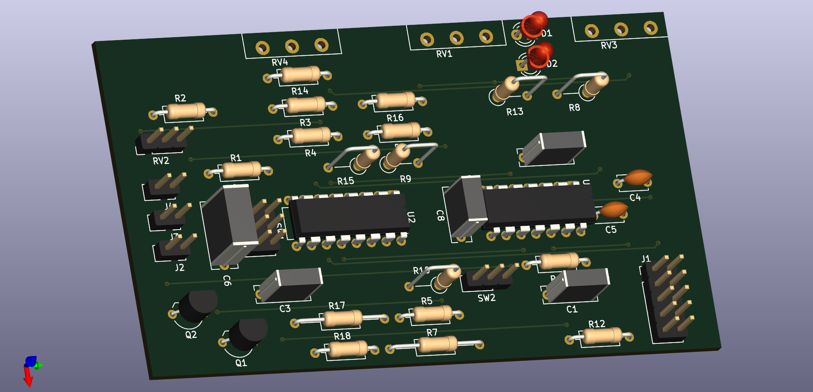

# diy-synth

Schematics and related files for DIY modular synthesizer components.

## MS-20 VCF

A voltage controller filter based on the "late" Korg MS-20 design. Original design schematics from [Rene Schmitz](https://www.schmitzbits.de/ms20.html) and [Eddy Bergman](https://www.eddybergman.com/2019/12/synthesizer-build-part-12-korg-ms20.html?m=1).

**Working Falstad circuit simulation (online):** [click here][1]

### Features

* Designed for Eurorack format with a 6 HP frontplate and standard +/- 12 V power supply.
* Frontplate potentiometers to control filter cutoff, resonance, input level, and cutoff CV amount.
* Input jacks for source audio signal and cutoff CV; output jack for filtered audio signal.
* Quad opamp (LM324N) and dual OTA (LM13700) in the main circuit.
* LEDs in the resonance feedback circuit indicate resonance "drive".

### Layout

* Circuit schematics: [VCF_MS-20_plan.pdf](./schematics/VCF_MS-20_plan.pdf)
* Board layout: [VCF_MS-20_pcb.pdf](./schematics/VCF_MS-20_pcb.pdf)
   * The board is a 21 x 36 hole (56 x 97 mm) perforated PCB that should fit in most Eurorack cases. The required depth is about 60 mm.
* Board layout with frontplate design: [VCF_MS-20_pcb_all.pdf](./schematics/VCF_MS-20_pcb_all.pdf)
   * The frontplate is designed for Eurorack cases and has a size of 3 U x 6 HP (127 x 30.5 mm)

### Components (BOM)

*Estimated costs ~ 25 Euro* (in Germany, as of Nov 2023)

|Item |Qty  |Reference(s)                  |Value          |Datasheet                                         |Note           |
|----:|----:|-----------------------------:|--------------:|--------------------------------------------------|---------------|
|    1|    1|                            C1|           4.7n|~                                                 |               |
|    2|    2|                        C2, C3|           1.0n|~                                                 |film cap.      |
|    3|    2|                        C4, C5|           100n|~                                                 |               |
|    4|    1|                            C6|           1.0u|~                                                 |               |
|    5|    2|                            C8|           470n|~                                                 |film cap.      |
|    6|    2|                        D1, D2|            LED|~                                                 |               |
|    7|    1|                            J1|          POWER|~                                                 |               |
|    8|    1|                            J2|       AUDIO IN|~                                                 |               |
|    9|    1|                            J3|      AUDIO OUT|~                                                 |               |
|   10|    1|                            J4|          CV IN|~                                                 |               |
|   11|    2|                        Q1, Q2|         BC558C|https://www.onsemi.com/pub/Collateral/BC556BTA-D.pdf|             |
|   12|    1|                            R1|           200k|~                                                 |               |
|   13|    2|                        R2, R3|           100k|~                                                 |               |
|   14|    6|       R4, R5, R6, R7, R9, R10|            10k|~                                                 |               |
|   15|    1|                            R8|            10k|~                                                 |Feedback       |
|   16|    1|                           R11|           4.7k|~                                                 |               |
|   17|    1|                           R12|           470k|~                                                 |               |
|   18|    1|                           R13|           2.2k|~                                                 |               |
|   19|    1|                           R14|           1.5k|~                                                 |               |
|   20|    4|            R15, R16, R17, R18|            220|~                                                 |               |
|   21|    1|                           RV1|     100k / log|~                                                 |Resonance      |
|   22|    2|                      RV2, RV3|     100k / lin|~                                                 |CV Amount      |
|   23|    1|                           RV4|           100k|~                                                 |Input Level    |
|   24|    1|                           SW1|     SW_DPDT_x2|~                                                 |HP/LP          |
|   25|    1|                           SW2|       SW_SPDTT|~                                                 |6/12 dB        |
|   26|    1|                            U1|         LM324N|http://www.ti.com/lit/ds/symlink/lm2902-n.pdf     |               |
|   27|    1|                            U2|        LM13700|http://www.ti.com/lit/ds/symlink/lm13700.pdf      |               |

Notes:
* Use film capacitors in the audio signal path, not ceramic ones. (Ceramic ones have a voltage dependency that causes distortions.)
* The feedback resistor R8 could be tuned to change the resonance characteristics. Hence R8 is replaced with a suitable trimpot. Check out the [circuit simulation][1] to see what this does.

[1]: https://falstad.com/circuit/circuitjs.html?ctz=CQAgbArCAMB00OgRgCwE4Oa9kAme0AHBBAMxhq6lKEDsYt4aISuIGMBiSAUCtGxRIwefiAitR0FjAA6AZ2gL+CgLSsFSxZthQtWlfI3aTcPQqRqkcMGFxoUVGqVooUpFDpQQ37wkiQfNGowSyMEBQATAFMAMwBDAFcAGwAXOSM1OG9fUn9A9BCw7J8aNGh0V0JyEIsI+RiElPStYq9SwnLKlGqwWvCtRqS0jLD1JFhhaAhiWlxaCEg7Qi9ceYRy8gr0Qj66wbjhlosrCehg8lpzl1YiL29rV2siPpdSfajD5oz1VdwKOyuWhoQjVeZgLKwRy4NxINCoUgzSi0d4DT5NEZaX4mVTZNaw+HuJHzVHPdFHH5hNawUjnFFrBDkYSQSHQgHzFDA0GkcEfBpfTFWe4SAQQXBIPLCTkQVluQic4ESTmEfG0PlDb5YtryXFQuUKtBK2gqmFqtH8jHHHVhAI0hYqyiIzq0Y0rHXZB6i8WSsDS9UCq3avEwlwQIhlATIGXmjWCzLuqFrCjigT2QJivaKRMhhbhzqRwL+y2jKxwUHlcrVK6UJBm4PJ6xreEkf6k+qxwOaHQbHkOaDG-soBgQOZFimtLsJ5C0l3nXauG7GMkWo48eLgFBSFiSGHSQgsNjqNjPRDSOAusXAhjTWvQWmkTgX3B0RykahvEgsU-QNcgIeb8ZBGEEBAPYA8QMkE9EBAuBvz6Z8eioEc4WgOxN2kKCfwAdwPfc4UEPDKBgHgcNYfdd23NgKOwv9CIIvAYWInCegYzdfVYpjxCI-FxHoDiaJHEQeMElgiIEvj8PARZRLYGili3X1pGokjxB3MQROUnCNPUvjcGk8ShOkiBuP0lSWIo8zTOY8jpPYvSRBonlpCEEQWJczjLNc-daXQlSNKMvifOIgBjWiQCCli3wclholUZhSFgCg3wQfweWM+w3E4BBeFCkSgry8gYBiuKYNgf4R0VMVHDmEdmFg5AzO8wq3OAn8ACcWEyijJOor9EDMhA8CIP9gNwYbHPlFgwGc4Cpk4+TJIW6b5ukub-yms8eA69y1vYuaMNPLaIMg5bVD25aDv6nDQLm9RMv2lSzs3OayI2zjXtrEQPrEo68k3Z9vMmqKioZX7CoB8LCuBpSxpUv68FBcLJvmWS4fBuZIaExH2ogrrEbuzdoYYnH1G4-HJKJ0GOtUeytxp4beqgo7VHIbyxRA1m-0GpTvx4ULVH4aQgoFnlwoqIr6u4UrhB8sVFhdAIFayhrrs5xFDzV8Wcfc9xBHY3WQdvAbnNFnXRZ-YQ2GBiRBEGm28BADtVGSaJIhkM8st4S2uekHxCcKv2Hadl23aQCXPbRkR7ac1TUZw63MpjwPHLG8RE9T+2aMFv9Rfhg2s7tzLs8zsGvKFyaeg9pn44rwhnMGyvOOBxuY8bi3XBAUETbYLvwrAPC+ug88XBEAAlaJ5AAewAO3iafguiR6DeFlutZ4dJUAAuuWD41Rt+kdRSoEaoAk6HoKzFexSrDVDDVpBBfV2ftxEGjt14R-c96U6Sv6Kw-bQqLsMgb5dj+GTKVTkVBZz0AoOmVgjAb6OwDI9UW+9O6bWYmgISw10AiH3mZLB6C-zsXwdtYC291poKZh1Pczl9xUMOjhWmT08A-1aipT6IFCGcNAjRHhAQqJsMkDRZhAjWEiDig5FSojJDA14aXY6VtJq8L-FcH8oVs6SJ9iBdizlYBqO-IYpAsU6qJR5MQbwvoxqoDhHoAgvBmKDS0ZosRBcD76ycSxNxIEWI8K8Rw3evjd66LMuxZx28tFZwiYQxuAt9xRIPm5Tx8Sjo8NFpw1qqjGE7wkUEiR5sOGZV-mI3+NF1BCTEOZMQclpIUSuP9apS9BrC01r5ayRDab4OYuQ7+eDNr8EPGIii5Stxh30MoLUuBJz6F0BkAwrQpmmB0OYeM6gbBkF2IaBCRAXSohKLkfIiw3isAhDGAMJYEw5DcJKQIfQUQnPaEIfMlQiDkAYGOTUJxTBQg6F0NAVxejvLOcWCc1ozgLCbJAUEaxxTFB+UIC8OzOSV19B8uMYxbTJlnNUeUCI3w6FNJgEcc47wLHoGiq02J9m1nslcAId5QSsjIPCY0ZK8ikH+WgCllJJy6m8By2sdARzss5dyrUChqTOBVHQCsQ4KBMoRbS5A1g8humXB2HlWYYTVAcHXFVGAeh5EhNqt8VAMCgjcLQT6YqhQ4jgCankHKQTyk5Na4F45bXWH0fMEEZAyWhHlNGXUJrdXIDvAanFNr4wzP5fCe+dhfQSmmKc9V5zQV8tKAwegjJ-kctOSUAV8b-hCFpIsKNGKJjzjGrYYlc4WRZhyMIF001w0oiweW3lcBazuA5VVf4wR6DRlTSCr5My7xSpLZUOYOqU3tmQarKiw0WY9wwUjACYiXHCLMsBUCm647EPXc+WiB9Xo4xKekk6RVAgIA4ZIZdlEQKkJ8Z-NBpTB43u7RBI9oEjyf18e+s8UJkAgAAMKJFSJPWIsRHolIiSxUpKkD7b1g5tAA5hzfu2iWaYfcmhiCRE5EU3ZnhgmmNcaE2I8RdDwMaNQ0oz+ajQMoZA3ozwdDYompR1kYVPD60DaN3zlR49X79y4JExLNjD7ZqyNksRUe4m4kKcyfXcCHszA8Hk7+xRSnMoezEEecO6nNMcbI6oRYQseN-jFgdQzugeC3hAvbFGjnlrObDgycKYobO8AAMrPqFuLMzsitZFQSMkeQ0QQaPScxjILVFsbRaPXI6OPHovcYkdHVOP5OZxICwBFumGxkgAAJLTx4JzV63Uj1uavfIVICgADy4HyuYfkhRNrGMiu4GnpERrzWKt3uQ3ej6RUABCABLeI8hytXHERBQyIh0kSfXHnYCzdgLMGG8eQxEFExwl9DyNYEorWoV244OEwQwxUE5KEADcNU7uXW1I9DvcDava8XJnJU0vsfZUwZtTdn0MQ1-sLNBP4Gud23mNfcWCeYDz4dVsQm8txlKGUunq40YPcX0z1BL11kfA4JxjVHXVYtDOJzB0ngyuqNPx9jg+0OUeU4aSe+6F0OFHskpV2n2jGfA0ZyI2pYh+c85FxZoSFP47g2F+DTHNd-oY3cs5mpFTpALR+vLt68NlfSOkqLTpm11zpQUmICieFBnbe-KVcqzaz5QuoBKAC9rIAukNH2mqwI7uq0wy08WQVss4dE8BNy-7pAADFoiuwAEbxGCgAaz4HeIqjcxHJ06qQAA+oQDP0AM9EhQBn6whf8DZ-UBn3Ahf3AZ9IInh8McRnL1k4rLPOe8+Ikz0XyWdIlh6Qz2Xivzea+wsh0pMQ-zVdXo2oNBxI+hr0Khzz3uZvt6cxorsTcxciLZwD-uY3m-BCh5AOPKes956Ly0lv5pFdua1-EEexuik07oRYGGFvuf88Z4gDnyYfekDl8L6-jXjlsjrdCAZzrVvVvIKVi1oDM9MtPDCNkpD1goNAThGCHPrPgLsbDnLbHQqutnAJnbFuvHA9ivg9uwiQXgeFBnFuvwA+GhGLJuCiItphhhIEG-m3j4IXrnqwLAKXn-gPuwTXnQSBBDIQuoBJBdC-pntnu-oiAXnANQL3mWL-v-oEJnsIUnmZvfjugQVQhKBwR-p3j-v3oXgYZoQ+IQkFDxKvtuAXrIZwQXsYX-qYQEAXhYRxFYezPtC-vYa3h-l2osMoSYQIQAe4bfp0F9JzgIM9GJAeDIf4fIdwd-i4X-jlCAMaP9MNOgQLn+PooYgUdMLFIwBMLYNDvKCqFas8HQMrDPswRgZkRgTRPUl9i0ZJM0eLHUp0YxB0c9LpIjJwgjnhBJJzuzgAB4ZGBAsDEAZH3SIzPRsRRCjbSIDEjHDFSJMJC4YT07ER+b1GM4tG5HSBhYRZRYTFWr-R5AZESCiBhwLEHhLF+RJaYY0wYyr48B+bmaeZsAmbqyT4nGRZKR+SBQByBTEbAmLbsxfF-E-h+Ysx+6BbOb+6hbxDhaAl4CPRImpyvFWysGYkYzA7OaaSiEEn6a0zKQTHwl14uCiEzEeDOSdQgAAASAACjwJSffAjA+DTNUAjK5IyQADJskTFkCLa0jiBkCQwPj3FCnslpzlxhwkCwFWaoDMlsl06Lqfw9SNIiGcK-HiwiTORf4OFEiZ74Bf71S3K96mHeDV636cLrT5TCJ-h+FyFkDl66Df6MisBf42nhGTzbgPiZKhA5BfjKzAZKSBnhQ8ABkBAPjxIZGoTLQSiTD9iyRcBhzuZRk16xlUDfYYT0CoA-FQiuA3yGjeD-JQLhlZm8C5nxlFRXC2C+ycBhxBnla75hxh5FYYQ3wnogAR7R6x5x4KDH7jZ1ZzwLztlfiMBdnhQgyIKHw+aTyJBtQLwKBh5tTRAACOiQ0Q88AAnlOcyP2UVmcIUUYsUeIFwOedlJeYfE1qkAAA7gYKAgbxCPmx7japATmLxAA
